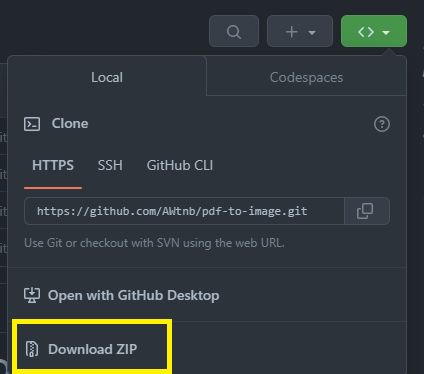
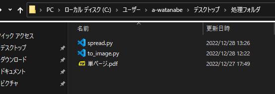
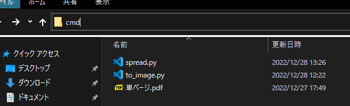
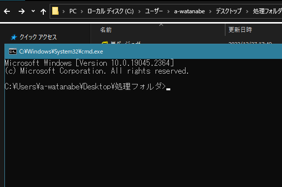
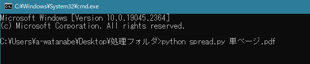
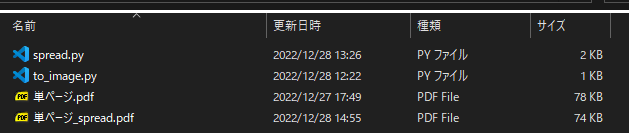
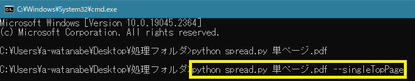
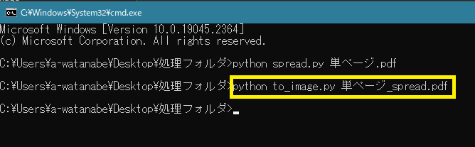
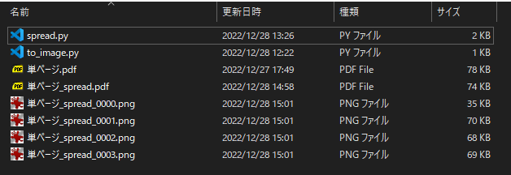

# Python で PDF を見開きの画像に変換する方法

+ 概要：単ページ PDF ファイルを見開きに左右結合して、それをさらに画像ファイルに変換する方法を書いています
+ プログラムとして [Python](https://www.python.org/) を使用します
+ Windows 10 以降での使用を想定しています
+ 初回のみ、プログラムを実行するための環境を準備する必要があります → [セットアップ手順](./setup.md)

------------------------------


## 必要なファイルの準備

このページ上部の緑色のボタンを押して、`Download ZIP` をクリックすると、このリポジトリの内容がパソコンにダウンロードされます。



Zip 形式のファイルでダウンロードされるので解凍しておきます。


中身を解凍できたら、`spread.py` と `to_image.py` の2つのファイルを対象の PDF ファイルと同じフォルダにコピーします。


## 作業フォルダでコマンドプロンプトを開く

画像化したい PDF ファイルの置いてあるフォルダを開いて、



アドレスバーに `cmd` と入力してエンターキーを押すと……



黒い窓が開きます。



点滅しているカーソルの左側に表示されているのは、コマンドの対象となるフォルダです。
上図の場合は、この窓に入力されたコマンドは、デスクトップの `処理フォルダ` を対象に実行されることを意味しています。

## プログラムを走らせる

Python のインストールが済んでいるので、黒い窓に `python` に続けてコマンドを入力することで Python に指示を出せるようになっています。

### 処理1：単ページ PDF を見開きに結合する

```
python spread.py 単ページ.pdf
```

上記コマンドを入力して（ある程度入力して <kbd>Tab</kbd> を押せば補完されます）エンターキーを押すことでプログラムが実行されます。



+ 見開き形式に左右結合した PDF が新規作成されます。
+ ファイル名は元のファイルの末尾に `_spread` を付けたものになります。



全体のページ数が奇数の場合、何もしないと最後のページは単ページのママになります。

この場合に、先頭を単ページにしたい場合は、コマンドの末尾に `--singleTopPage` と付記します。




### 処理2：見開き PDF を画像に変換する

同様に下記コマンドを実行すると……

```
python to_image.py 単ページ_spread.pdf
```




各ページを PNG ファイルとして同じフォルダに書き出します。




書き出された画像ファイルの寸法が小さい場合は、[`to_image.py`](./to_image.py) の下記部分の数値を大きくすることで解像度を上げることができます（デフォルトは300）。

```python
pix = page.get_pixmap(dpi=300)
```