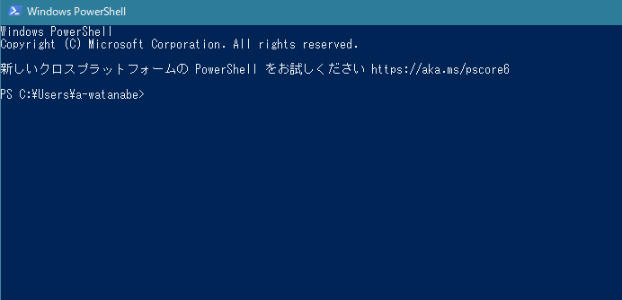
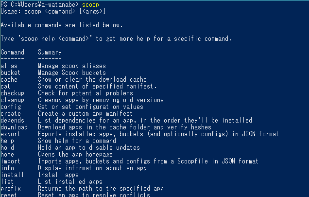

# Python で PDF を見開きの画像に変換する方法

+ 概要：単ページ PDF ファイルを見開きに左右結合して、それをさらに画像ファイルに変換する方法を書いています
+ プログラムとして [Python](https://www.python.org/) を使用します
+ Windows 10 以降での使用を想定しています

------------------------------


## 環境構築（初回のみ）


### Python をインストールするための環境を準備する

ここでは [scoop](https://scoop.sh/) を使用してコマンドラインで Python をインストールします。

### PowerShell を開く

<kbd>Start</kbd>（Windowsロゴの印字されたキー）を押して `PowerShell` と入力すると、`Windows PowerShell` というアプリが見つかるのでクリックすると……


青い画面が開くはずです。



カーソルが点滅して入力待ち状態になっているので、ここに各種コマンドを入力することでコンピュータを操作していきます。

#### 権限の取得

PowerShell はなんでもできてしまうので、初回起動時は制限がかかっています。その解除のために、入力欄に下記のコマンドを貼り付けてエンターキーを押します。

```PowerShell
Set-ExecutionPolicy RemoteSigned -Scope CurrentUser
```

警告文が表示されるので、`y` を入力してエンターキー。


これでユーザーの指示をコンピュータが受け付ける準備が整います。

### Scoop をインストールする

あらためて下記コマンドを貼り付けてエンターキー。

```PowerShell
irm get.scoop.sh | iex
```

色々表示されてから、再びカーソルが点滅して入力待ち状態になるまで少し待機。

入力待ち状態になってから `scoop` と入力してエンターキーを押し、下記のような表示になれば無事にインストール完了です。



#### 必須アプリケーションのインストール

scoop で各種ソフトをインストールするために、git というソフトが必要です。下記のコマンドでインストールしておきます。

```
scoop install git
```

そのうえで、Python をインストールするために下記コマンドを入力。

```
scoop install python
```

ひと通り文字が出力されて、再び入力待ちになるまで待機。下記のコマンドを入力して、

```
python --version
```

バージョン情報が表示されたら無事にインストール完了です。


### Python ライブラリの準備

Python という実行系の上で各種 PDF の処理を行うために、専用のライブラリをインストールする必要があります。

今回使用するのは下記の2点。

+ [pdfrw](https://github.com/pmaupin/pdfrw)
+ [PyMuPDF](https://github.com/pymupdf/PyMuPDF)

Python をインストールするとライブラリをインストールするための `pip` というコマンドが自動でついてきます。`pip` に続けて各種オプションを指定してやることで色々な操作が可能になります。


必要なライブラリを揃えるには、下記のようにコマンドを入力します。

```
pip install pdfrw
```

```
pip install PyMuPDF
```

ライブラリの準備が整っているか確認するためには `pip list` と入力し、表示されたリストに上記2点が含まれていればOK（環境によって表示される内容は異なります）。


お疲れ様です！ これで準備は整いました。
もう PowerShell の青い窓は閉じて大丈夫です。

------------------------------

## プログラムの実行

### 必要なファイルの準備

このページ上部の緑色のボタンを押して、`Download ZIP` をクリックすると、このリポジトリの内容がパソコンにダウンロードされます。


Zip 形式のファイルでダウンロードされるので解凍しておきます。


中身を解凍できたら、`spread.py` と `to_image.py` の2つのファイルを対象の PDF ファイルと同じフォルダにコピーします。


### 作業フォルダでコマンドプロンプトを開く

画像化したい PDF ファイルの置いてあるフォルダを開いて、


アドレスバーに `cmd` と入力してエンターキーを押すと……


黒い窓が開きます。


点滅しているカーソルの左側に表示されているのは、コマンドの対象となるフォルダです。
上図の場合は、この窓に入力されたコマンドは、デスクトップの `処理フォルダ` を対象に実行されることを意味しています。

### プログラムを走らせる

Python のインストールが済んでいるので、黒い窓に `python` に続けてコマンドを入力することで Python に指示を出せるようになっています。

#### 処理1：単ページ PDF を見開きに結合する

```
python spread.py 単ページ.pdf
```

上記コマンドを入力して（ある程度入力して <kbd>Tab</kbd> を押せば補完されます）エンターキーを押すことでプログラムが実行されます。


+ 見開き形式に左右結合した PDF が新規作成されます。
+ ファイル名は元のファイルの末尾に `_spread` を付けたものになります。


全体のページ数が奇数の場合、何もしないと最後のページは単ページのママになります。

この場合に、先頭を単ページにしたい場合は、コマンドの末尾に `--singleTopPage` と付記します。


#### 処理2：見開き PDF を画像に変換する

同様に下記コマンドを実行すると……

```
python to_image.py 単ページ_spread.pdf
```


各ページを PNG ファイルとして同じフォルダに書き出します。


書き出された画像ファイルの寸法が小さい場合は、[`to_image.py`](./to_image.py) の下記部分の数値を大きくすることで解像度を上げることができます（デフォルトは300）。

```python
pix = page.get_pixmap(dpi=300)
```