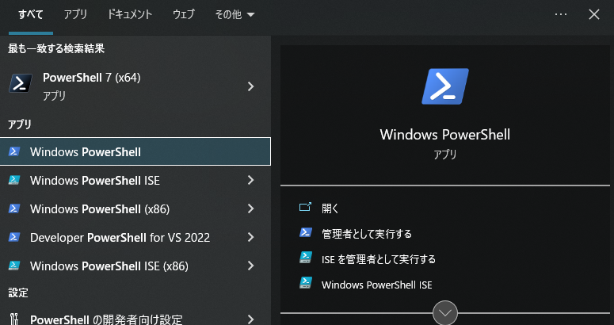
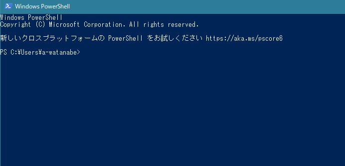
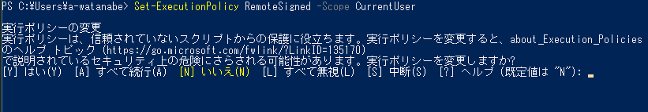
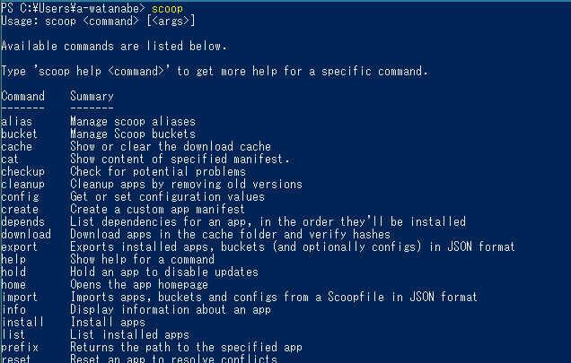
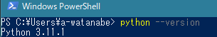
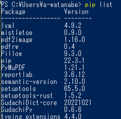

# 環境構築


## Python をインストールするための環境を準備する

ここでは [scoop](https://scoop.sh/) を使用してコマンドラインで Python をインストールします。

### PowerShell を開く

<kbd>Start</kbd>（Windowsロゴの印字されたキー）を押して `PowerShell` と入力すると、`Windows PowerShell` というアプリが見つかるのでクリックすると……



青い画面が開くはずです。



カーソルが点滅して入力待ち状態になっているので、ここに各種コマンドを入力することでコンピュータを操作していきます。

### 権限の取得

PowerShell はなんでもできてしまうので、初回起動時は制限がかかっています。その解除のために、入力欄に下記のコマンドを貼り付けてエンターキーを押します。

```PowerShell
Set-ExecutionPolicy RemoteSigned -Scope CurrentUser
```

警告文が表示されるので、`y` を入力してエンターキー。



これでユーザーの指示をコンピュータが受け付ける準備が整います。

## Scoop をインストールする

あらためて下記コマンドを貼り付けてエンターキー。

```PowerShell
irm get.scoop.sh | iex
```

色々表示されてから、再びカーソルが点滅して入力待ち状態になるまで少し待機。

入力待ち状態になってから `scoop` と入力してエンターキーを押し、下記のような表示になれば無事にインストール完了です。



#### 必須アプリケーションのインストール

scoop で各種ソフトをインストールするために、git というソフトが必要です。下記のコマンドでインストールしておきます。

```
scoop install git
```

そのうえで、Python をインストールするために下記コマンドを入力。

```
scoop install python
```

ひと通り文字が出力されて、再び入力待ちになるまで待機。下記のコマンドを入力して、

```
python --version
```

バージョン情報が表示されたら無事にインストール完了です。




## Python ライブラリの準備

Python という実行系の上で各種 PDF の処理を行うために、専用のライブラリをインストールする必要があります。

今回使用するのは下記の2点。

+ [pdfrw](https://github.com/pmaupin/pdfrw)
+ [PyMuPDF](https://github.com/pymupdf/PyMuPDF)

Python をインストールするとライブラリをインストールするための `pip` というコマンドが自動でついてきます。`pip` に続けて各種オプションを指定してやることで色々な操作が可能になります。


必要なライブラリを揃えるには、下記のようにコマンドを入力します。

```
pip install pdfrw
```

```
pip install PyMuPDF
```

ライブラリの準備が整っているか確認するためには `pip list` と入力し、表示されたリストに上記2点が含まれていればOK（環境によって表示される内容は異なります）。




お疲れ様です！ これで準備は整いました。
もう PowerShell の青い窓は閉じて大丈夫です。
